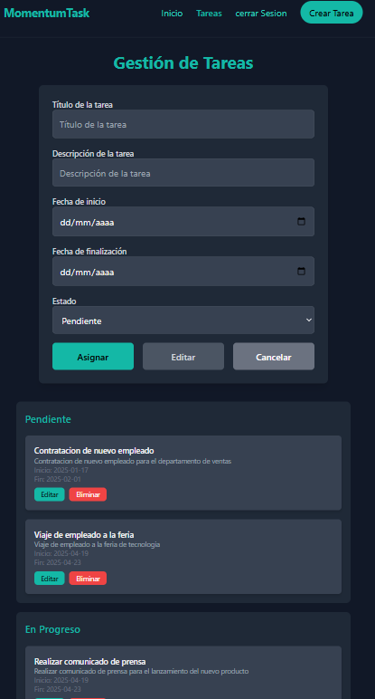

## Descripción General

TaskApp ofrece un tablero Kanban dinámico para gestionar tareas y eventos, con tres columnas (Pendientes, En Progreso, Completadas) y autenticación de usuarios para un acceso seguro. La aplicación es completamente responsiva, estilizada con Tailwind CSS, y se integra con una API REST simulada mediante **json-server**, que utiliza un archivo `db.json` para almacenar tareas y usuarios. La estructura del proyecto incluye un tablero de tareas (`index.html`), páginas de inicio de sesión/registro (`usuario/index.html`, `usuario/registro.html`) y archivos JavaScript para la funcionalidad.


- **Autenticación de Usuarios**:
  - Inicio de sesión (`usuario/index.html`) y registro (`usuario/registro.html`) con nombre de usuario y contraseña.
  - Gestión de sesiones (`usuario/sesiones.js`) usando `localStorage` para rastrear usuarios autenticados.
  - Cierre de sesión mediante "Cerrar Sesión" en la navegación.
  - json-server almacena usuarios en `db.json` bajo la colección `usuarios`, con campos `id`, `usuario`, `password`.
- **Edición y Eliminación de Tareas**:
  - Editar tareas con un formulario dinámico y opción de cancelar (`#cancelar`).
  - Eliminar tareas con alertas de confirmación.
  - Retroalimentación visual para el estado del botón de edición (`bg-teal-500` cuando está habilitado, `bg-gray-600` cuando está deshabilitado).
- **Diseño Responsivo**:
  - Tailwind CSS asegura un diseño adaptado a dispositivos móviles (columnas apiladas en pantallas pequeñas, cuadrícula de tres columnas en pantallas grandes).
  - Tema oscuro consistente con acentos en color teal en todas las páginas.
- **Manejo de Errores y Retroalimentación**:
  - Alertas para éxito (`bg-green-500`), errores (`bg-red-500`) y acciones neutrales (`bg-gray-500`, por ejemplo, cancelar ediciones).
  - Las alertas se ocultan automáticamente después de 5 segundos.
  - Registros en consola para depuración (por ejemplo, "Editando tarea ID: ").
- **Navegación**:
  - Barra de navegación unificada en todas las páginas (Inicio, Tareas, Cerrar Sesión, Registrarse).
  - Rutas correctas (por ejemplo, `../index.html` desde `usuario/` al tablero).

## Configuración del Backend con json-server

TaskApp utiliza **json-server** para simular una API REST con un archivo `db.json` como base de datos. A continuación, se detalla la configuración:

1. **Instalar json-server**:

   - Asegúrate de tener Node.js instalado.
   - Instala json-server globalmente o en el proyecto:

     ```bash
     npm install -g json-server
     ```

     O localmente:

     ```bash
     npm install json-server
     ```

2. **Crear el archivo db.json**:

   - En la raíz del proyecto (o en un directorio separado), crea un archivo `db.json` con la siguiente estructura:

     ```json
     {
       "tareas": [],
       "usuarios": []
     }
     ```
   - **tareas**: Almacena objetos con `id` (generado por json-server), `titulo`, `descripcion`, `fechaInicio`, `fechaFin`, `estado`, `idusuario`.
   - **usuarios**: Almacena objetos con `id`, `usuario`, `password`.

3. **Ejecutar json-server**:

   - Inicia el servidor, especificando el puerto 3000:

     ```bash
     json-server --watch db.json --port 3000
     ```
   - Accede a la API en `http://localhost:3000`.
   - json-server genera automáticamente endpoints:
     - `GET /tareas`, `POST /tareas`, `PUT /tareas/:id`, `DELETE /tareas/:id`
     - `GET /usuarios`, `POST /usuarios`
     - Soporta filtros como `GET /tareas?idusuario=<username>`.

4. **Verificar la API**:

   - Usa un navegador o Postman para probar endpoints, por ejemplo:
     - `GET http://localhost:3000/tareas`
     - `POST http://localhost:3000/usuarios` con body `{ "usuario": "test", "password": "123" }`.
   - Asegúrate de que json-server esté corriendo antes de usar TaskApp.


**Visualización gestión de tareas**



